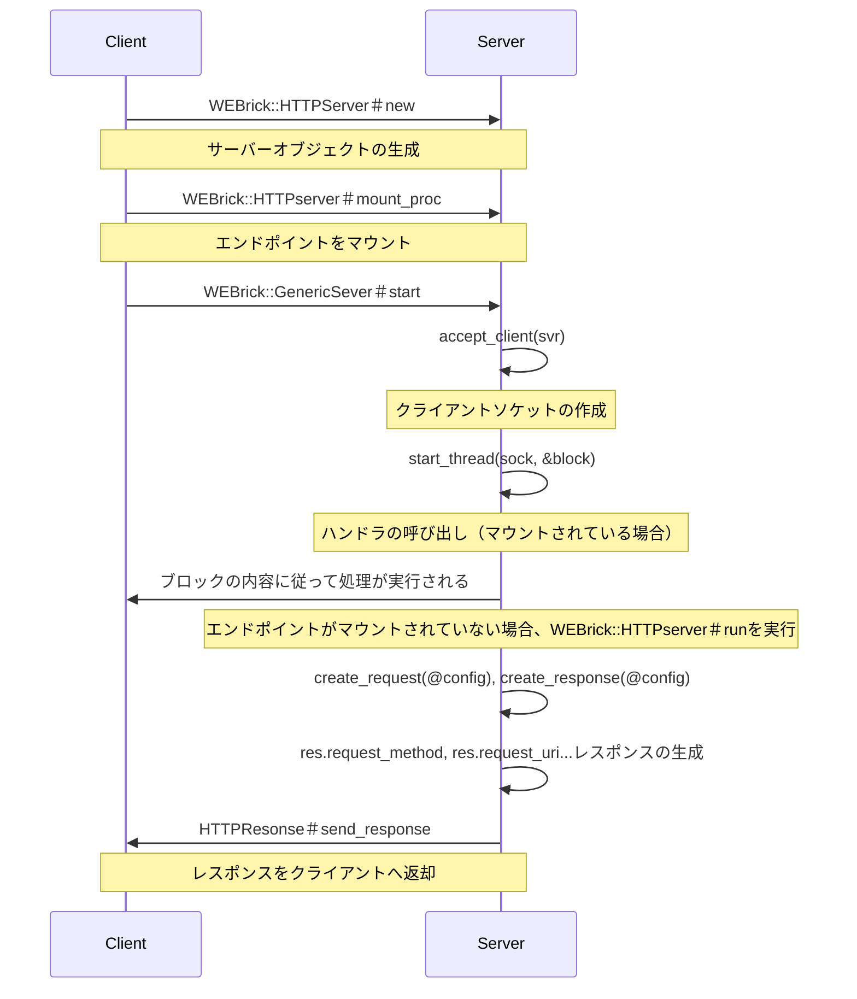

# Phase 2
## Webrick を読み解く

### STEP2
#### WEBrick::HTTPServer.new は何をしているか？

引数で指定されたポートやアドレスの情報に従って `HTTPServer` オブジェクトを作成している。

`lib/webrick/httpserver.rb:46`
`lib/webrick/server.rb:88`

#### start メソッドはどこに定義されているか

`WEBrick::GenericServer` クラスに定義されている。
`lib/webrick/server.rb:154`

#### start メソッドの中で何が起きているか

作成された `HTTPServer` オブジェクトを使ってサーバーを起動状態にし、シグナルハンドラによる停止や例外発生による終了がない限り動き続ける。

### STEP3

#### 1. TCP接続の受け付け

- クライアント側で `WEBrick::HTTPServer.new` でサーバーオブジェクトを作成する
- クライアント側で `WEBrick::HTTPserver#mount_proc` メソッドを使用してパス、ブロックでリクエストとレスポンスの詳細をマウントできる
- `WEBrick::GenericServer#start` メソッドがクライアント側で呼ばれる
- `WEBrick::GenericServer#start` メソッド内で `accept_client(svr)` が実行され、クライアントソケットが作成される

#### 2. リクエストの読み込み

- `WEBrick::GenericServer#start` メソッド内で `start_thread(sock, &block)` が実行される
- エンドポイントがマウントされていない場合は`start_thread` メソッド内(`lib/webrick/server.rb:309`)で`WEBrick::HTTPserver#run` メソッドが実行される

#### 3. リクエストオブジェクトの生成

- `WEBrick::HTTPserver#run` メソッド内で `HTTPserver#create_request` メソッドが呼ばれ、ポートやアドレスの情報を引数にして `HTTPRequest` オブジェクトが作成される
- `WEBrick::HTTPserver#run` メソッド内で `HTTPRequest` オブジェクトに対して、`HTTPRequest#parse` メソッドが実行され、リクエストヘッダーの解析が行われる

#### 4. ハンドラ（mount_proc）の呼び出し

- `WEBrick::GenericServer#start` メソッド内で `start_thread(sock, &block)` が実行される
- エンドポイントがマウントされている場合は`start_thread` メソッド内(`lib/webrick/server.rb:309`)でブロックを実行する

#### 5. レスポンスの生成

- エンドポイントがマウントされていない場合にレスポンスの生成処理が行われる
- `WEBrick::HTTPserver#run` メソッド内で `HTTPserver#create_response` メソッドが呼ばれ、ポートやアドレスの情報を引数にして `HTTPResponse` オブジェクトが作成される
- リクエストヘッダーの内容を元に `HTTPResponse` オブジェクトに書き込みが行われる

- エンドポイントがマウントされている場合はブロック内の処理に従う

#### 6. クライアントへの返却

- `lib/webrick/httpserver.rb:112` で `HTTPResponse#send_response` メソッドが実行される
- `HTTPResponse#send_response` では レスポンスヘッダーの返却とレスポンスボディの返却が行われている

### STEP4
#### HTTPServer クラス

HTTP でやり取りするサーバーを抽象化したクラス

#### HTTPRequest

リクエストヘッダーの解析など HTTP リクエストで必要な情報や振る舞いを抽象化したクラス

#### HTTPResponse

レスポンスヘッダーとレスポンスボディーを作成して HTTP レスポンスとして返却するための情報や振る舞いを抽象化したクラス

### STEP5

#### 自分の実装には無かった機能は何か？

##### エンドポイントをマウントする機能
###### なぜそれが必要か？

自前実装では一つのファイル内にパスごとの分岐を設けてレスポンスを作成していたが、個々の内容が肥大化するとコードが追いづらくなってしまう。
`mount_proc` メソッドにエンドポイントのパスと手続きをまとめたブロックを渡すようにすることで、管理がやりやすくなる。

###### どの部分が抽象化されているか？

自前実装でベタ書きしていたエンドポイントごとのリクエストとレスポンスの詳細を `mount_proc` メソッドで引き受けられるようにしている点。

##### ヘッダーを解析する機能
###### なぜそれが必要か？

自前実装ではリクエストヘッダーからメソッドやパスなど必要最小限の情報のみを読み取っていたが、実務レベルのサーバーではリクエストヘッダーの内容はもっと多岐に渡り、内容に応じて振る舞いを変える必要があるため。

###### どの部分が抽象化されているか？

リクエストヘッダーの解析を `HTTPRequest#parse` メソッドに任せている点。

##### Thread による並列な複数リクエスト対応
###### なぜそれが必要か？

自前実装では一つのリクエストが来ると、それを処理し終えるまで次のリクエストは受けられなかった。実務レベルのサーバーが一つのリクエストごとしか処理できないと、受付待ちのリクエストが溜まってしまうため。

###### どの部分が抽象化されているか？

並列なリクエスト対応を `GenerickServer#start_thread` メソッドに任せている点。

##### Keep-Alive による持続的接続
###### なぜそれが必要か？

自前実装ではリクエストごとに処理が完了すると接続を閉じていた。Keep-Alive によって接続を使い回せるようにすると、接続の確率と切断による負荷を減らして効率的にリクエストを処理することができる。

###### どの部分が抽象化されているか？

Keep-Alive を `HTTPRequest` クラスのアトリビュートとして読み書きできるようにしている点。

### STEP6

#### なぜリクエストがオブジェクトになっているのか？
  
リクエストヘッダーの解析など HTTP リクエストで必要な情報や振る舞いのみを責務として持たせることができるため

#### なぜレスポンスもオブジェクトなのか？

レスポンスヘッダーとレスポンスボディーを作成して HTTP レスポンスとして返却するための情報や振る舞いのみを責務として持たせることができるため

#### なぜ処理をブロックで渡すのか？

個々の手続きとして渡せるようにすることで、コードが肥大化するのを防ぐため

### 比較レポートと気付き

リクエストを受け付け、レスポンスを返すという一番基本となる部分は自前実装でも実現できていたが、実務レベルのサーバーと比較すると上記にまとめたように実装できていない機能がたくさんあることに気がついた。
自前実装は「リクエストを受け付け、レスポンスを返す」ことを実現することのみに注力していたため、自分が想定できる特定のケースのみに対応するように実装していたため、非常に単純な実装になっていた。
実務レベルのサーバーでは想定されるケースが自前実装の比ではなくなるため、クラスを抽出して責務を明確にして設計をしていく必要があったと理解している。
