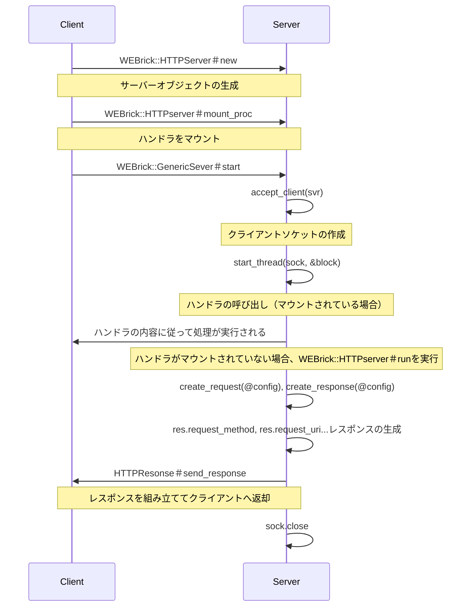

# Phase 2
## Webrick を読み解く

### STEP2
#### WEBrick::HTTPServer.new は何をしているか？

`lib/webrick/httpserver.rb:46` でリクエストを受け付けるためのサーバーを作成している。

#### start メソッドはどこに定義されているか

`lib/webrick/server.rb:154`

#### start メソッドの中で何が起きているか

サーバーを起動し、ステータスをRunningに更新、マウントされたハンドラの実行またはリクエストの読み込みとレスポンスの作成・返却をコネクションごとに実行するための起点となっている。
サーバーの切断があると、ステータスをStopに更新してサーバーを停止する。

### STEP3

- クライアント側で `WEBrick::HTTPServer.new` でサーバーオブジェクトを作成する
- クライアント側で `WEBrick::HTTPserver#mount_proc` メソッドを使用してパス、ブロックでリクエストとレスポンスの詳細をマウントできる
- `WEBrick::GenericServer#start` メソッドがクライアント側で呼ばれる
- `WEBrick::GenericServer#start` メソッド内で `accept_client(svr)` が実行され、クライアントソケットが作成される
- `WEBrick::GenericServer#start` メソッド内で `start_thread(sock, &block)` が実行される
  - `start_thread` メソッド内(`lib/webrick/server.rb:309`)で`WEBrick::HTTPserver#mount_proc` メソッドで指定されたブロックの呼び出しまたは、`WEBrick::HTTPserver#run` メソッドが実行される
- ブロックが実行された場合、その内容に従って処理が実行される
- `WEBrick::HTTPserver#run` メソッドが実行された場合、メソッド内でリクエストオブジェクトとレスポンスオブジェクトの作成が行われる(`lib/webrick/httpserver.rb:71, 72`)
- `lib/webrick/httpserver.rb:84` からレスポンスの生成が行われている
- `lib/webrick/httpserver.rb:112` で `lib/webrick/httpresponse.rb:238` の `HTTPResponse#send_response` メソッドが実行され、ヘッダーの組み立て、ボディへの書き込みとともにクライアントへの返却が行われる
- `WEBrick::GenericServer#start_thread` メソッド内でクライアントの接続が閉じられる(`lib/webrick/server.rb:326`)

### STEP4
#### HTTPServer クラス

HTTP レイヤーのサーバーとしてHTTPリクエストとHTTPのレスポンスのとりまとめを行うクラス

#### HTTPRequest

HTTP リクエストをオブジェクトとして扱い、必要な情報をアトリビュートで保持できるようにするクラス

#### HTTPResponse

HTTP レスポンスをオブジェクトとして扱い、必要な情報をアトリビュートで保持できるようにするクラス

### STEP5

- ソケットのレイヤーとHTTPのレイヤーが分かれている
  - `WEBrick::GenericServer`クラスと`WEBrick::HTTPServer`クラス
- HTTPリクエストとHTTPレスポンスをクラス化している
- オブジェクト指向設計
- Keep Aliveによる持続的接続
- 細かな例外ハンドリング
- Thread による複数リクエスト対応
- mount_procによるハンドラの登録
- ハンドラが登録されている場合とそうでない場合の両パターンへの対応 

### STEP6

#### なぜリクエストがオブジェクトになっているのか？

オブジェクト化することでリクエストがもつ情報をアトリビュートとメソッドを通じてカプセル化できるため
リクエストが担うべき処理をクラスの責務として実装できるため

#### なぜレスポンスもオブジェクトなのか？

オブジェクト化することでレスポンスがもつ情報をアトリビュートとメソッドを通じてカプセル化できるため
レスポンスが担うべき処理をクラスの責務として実装できるため

#### なぜ処理をブロックで渡すのか？

一まとまりの手続きとして渡すことができ、それを必要なタイミングで呼び出して実行できるため

### 比較レポートと気付き

自分の実装はクラスを導入していない。実装の段階からソケットのレイヤーやHTTPのレイヤーのことが混ざってしまっていて、レイヤーごとの役割を分けて考えることができていなかった。
クラス化することで、それぞれのクラスが担う責務が明確になり、どこに何の機能が必要なのかなどが分かりやすくなっている。
また、自分の実装はGETリクエストかそれ以外かという点でしかリクエストに対する判定をしていない。WEBrickの実装はもっと細かなエラー含めて各レイヤーごとに必要なエラーハンドリングが実装されていた。
エラーハンドリングを考える上で、どういう場合にどのようなエラーが起きうるかという点が自分自身で理解できていない。
自分の実装は1回のリクエストで接続が切れるようになっていて、WEBrickのように持続的接続に対応していない。
事前に持続的接続については調べていたため概要はイメージできたが、WEBrickがどう実現しているかについての細かい理解はまだできていない。実現する仕組みについては自前実装でシンプルな状態で試して理解したい。
複数リクエストも自前実装では対応していない。WEBrickはThread を使っていることはコードから分かったが、並行・並列処理自体への理解が浅いため、仕組みはちゃんとは分かっていない。

一番の気付きは、最も基本的なリクエストを受け付けてリクエストを返すという点は自前実装でできていたが、もう一歩踏み込んで一連の流れで登場する処理の責務を分割して、クラスとして考えていくとレイヤーを混ぜて考えてしまっていた部分やどこが受け持つ処理なのかが分からないまま実装してしまうという課題を整理していくことができるという点だった。

